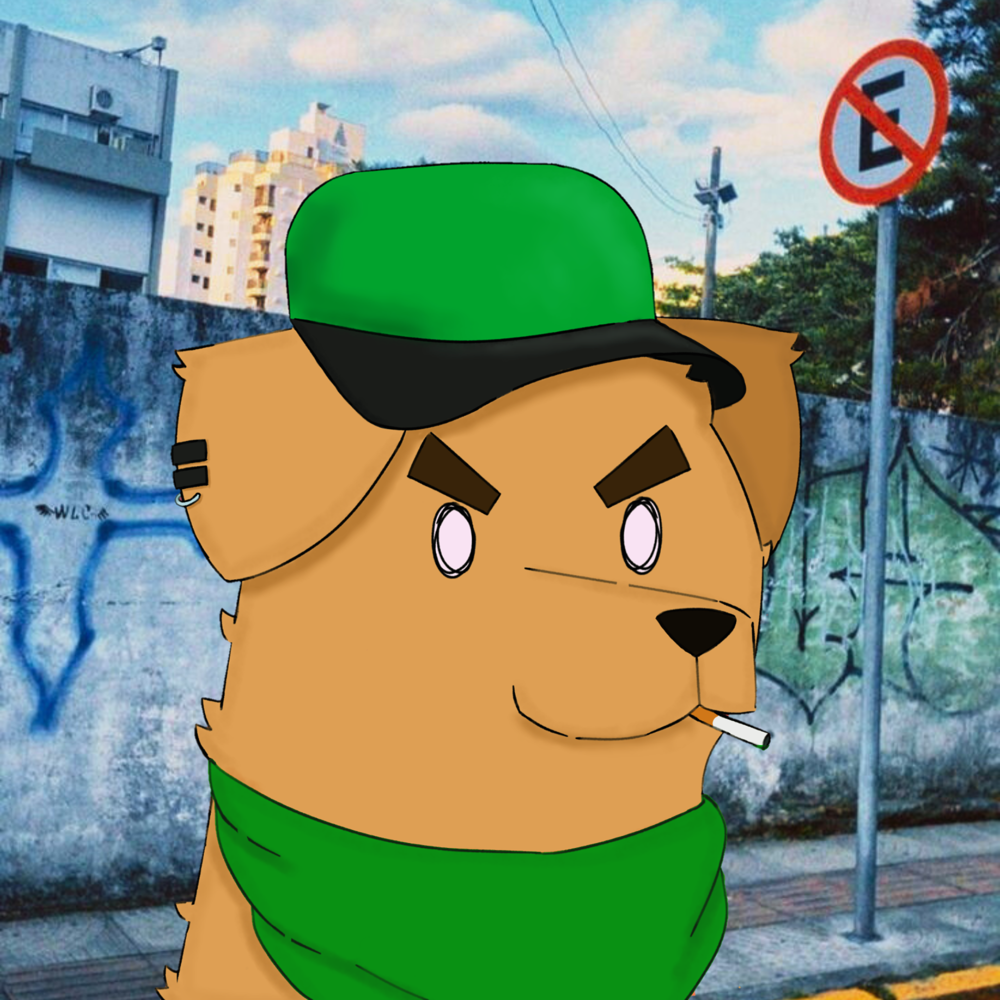

 

  

<h3 align="center">Senz Bot</h3>

  

    Um bot de diversão para o discord!
     
    <a href="https://discord.com/oauth2/authorize?client_id=1053032038598455339&permissions=689342642240&scope=applications.commands%20bot"><strong>Me adicione! »</strong></a>
     
     
  

## Sobre o projeto

Senz é um Bot pro Discord, focado em entretenimento, há comandos de economia, ranks para competir, imagens aleatórias de animais, XP, perfis estilizados, entre outras coisas. Senz foi feito usando a biblioteca `discord.py`.

### Ajude o projeto!

Ajude o Senz a se tornar um bot cada vez melhor!

Se você tiver alguma sugestão que possa melhorar o senz, Dé um fork no repositório e faça um pull request. Você também pode simplesmente abrir uma Issue.

1. Dê um Fork
2. Faça uma Branch pra sua feature
3. Commite a mudança
4. Dê um Push para a Branch
5. Abra um  Pull Request
